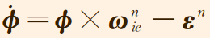
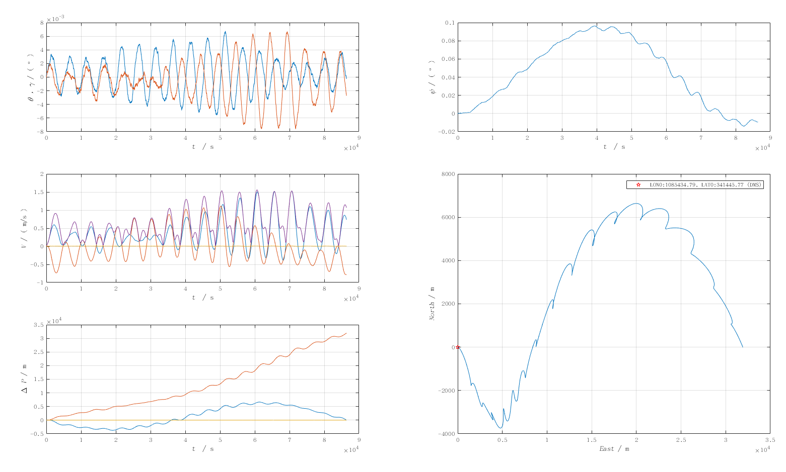

# INS-Inertial Navigation System

## 陀螺仪以及加速度计误差可以分为确定性误差以及随机误差

### 一,确定性误差

*1,概念*

主要是指陀螺仪与加速度计零偏，刻度系数误差，安装误差。

1）零偏

*误差解释：*

​        陀螺仪或加速度计输出中的常值漂移，即bias。以陀螺仪为例，角速度输入为零时，陀螺仪的输出是一条复合白噪声信号缓           

慢变化的曲线，曲线的平均值就是零偏值。

*误差特性：*

​         零偏存在不稳定性。

*解决办法：*

​         实际使用中，只能一段时间近似为常值。

2）刻度系数误差

*误差解释：*

​        器件的输出往往为脉冲值或模数转换得到的值，需要乘以一个刻度系数才能转换成角速度或加速度值，若该系数不准，便

存在刻度系数误差。

*误差特性：*

​        不一定是常值，会随输入大小的不同而发生变化，即标度因数的非线性。

*解决办法：*

​         如果非线性程度比较大，则需要在标定之前先拟合该非线性曲线，并补偿为线性再去标定。

3）安装误差

*误差解释：*

​         如下图所示，b系是正交的IMU坐标系，g坐标系的三个轴分别对应三个陀螺仪。由于加工工艺原因，陀螺仪的三个轴并不

正交，而且和b坐标系的轴并不重合，二者之间的偏差即为安装误差。

*误差特性：*

​         实际系统中，由于硬件结构受温度影响，安装误差也会随着温度发生变化。

*解决办法：*

​         在不同温度下做标定，补偿温度变化量。


4）IMU内参误差模型

*2，标定方法概述*

标定的本质是参数辨识，参数包含陀螺仪和加速度计各自的零偏，刻度系数误差，安装误差。

参数辨识方法包括：

1）解析法或最小二乘

2）梯度下降迭代优化

3）滤波（kalman等）

常见标定方法与辨识方法对应关系：

1）分立级标定：解析法，最小二乘

2）半系统级标定：梯度下降迭代优化

3）系统级标定：Kalman滤波，最小二乘

（1）分开立级标定

*概念：*

IMU误差模型中，陀螺仪和加速度计误差方程是相互独立的，可以分别标定。

*分立级标定的核心：*

通过旋转IMU，改变其输入构造方程组，并且每个位置对应的加速度输入和角速度输入都必须是已知的。

*求解条件：*

不仅方程组数量足够，且误差参数可解，系数矩阵可逆。

*方案：*

六位置，八位置，十二位置。

（2）半系统级标定

*概念：*

脱离转台，从天然真值（重力加速度）中去寻找约束。

*半系统级标定的核心：*

加速度计测的重力大小与真实重力之间的差异，由加速度计内参误差引起，以此为残差，并估计加速度计内参。陀螺仪计算得

到的姿态与真实姿态之间的差异由陀螺仪内参误差引起，但真实姿态并不存在，因此根据姿态投影得到的重力矢量与真实重力

矢量之间的差异计算残差，去估计陀螺仪内参。

*方案：*

本质是为了使优化模型有唯一的解。

（3）系统级标定

*概念：*

系统级标定需要用到kalman滤波，观测性分析，导航误差模型等知识。

*核心：*


### 二,随机误差

*1,概念：*

随机误差通常假定噪声服从高斯分布，以陀螺仪为例，包括以下几种误差：

*（1）量化噪声(Quantization Noise，QN)：*

*概念：*

一切量化操作所固有的噪声，是数字传感器必然出现的噪声；

*产生原因：*

通过AD采样把连续时间信号采集成离散信号过程中，精度会损失，精度损失大小和AD转换步长有关，步长越小，量化噪声越

小。

*公式：*

这里 为时间间隔，后面公式同上。

国际单位：rad

常用单位：

依据单位换算关系得到常用单位：

由公式可知，在Allan方差双对数图上，量化噪声对应的斜率为-1，其与交点的纵坐标读数为，如下图所示：


​        量化噪声具有很宽的带宽，属于高频噪声，在实际应用中可进行低通滤波器或大部分被导航姿态更新（积分）环节所滤

除，一般对系统精度影响不大。

（2）白噪声/角度随机游走(Angular Random Walk)：

*概念：*

​        宽带角速率白噪声积分的结果，即陀螺从零时刻起累积的总角增量误差表现为随机游走，而每一时刻的等效角速率误差表

现为白噪声；

*产生原因：*

​        计算姿态的本质是对角速率做积分，这必然会对噪声也做了积分。白噪声的积分并不是白噪声，而是一个马尔可夫过程，

即当前时刻的误差是在上一个时刻误差的基础上累加一个随机白噪声得到的。角度误差中所包含的马尔可夫性质的误差，称为

角度随机游走。

*公式：*


*国际单位：*


*常用单位：*

​        依据单位换算关系得到常用单位：

​        在双对数曲线图上，角度随机游走的斜率为-1/2，其（或延长线）与的交点纵坐标读数即为角度随机游走，如下图所示：


（3）角速率随机游走(Rate Random Walk, RRW)：概念：与角度随机游走类似，角速率误差中所包含的马尔可夫性质的误差，

称为角速率随机游走。

*产生原因：*

这个马尔可夫性质的误差是由宽带角加速率白噪声累积的结果。

*公式：*


*国际单位：*


*常用单位：*

依据单位换算关系得到常用单位：

在双对数图上，角速率随机游走的斜率为1/2，其（延长线）与交点纵坐标读数为，如下图所示：


（4）零偏不稳定性噪声(Bias Instability，BI)：

*零偏：*

​        即是指bias，一般不是一个固定的参数，而是在一定范围内缓慢随机漂移。

*零偏不稳定性：*

​        零偏随时间缓慢变化，其变化值无法预估，需要假定一个概率区间描述其有多大可能性落在这个区间内。时间越长，区间

越大。

*零偏稳定性：*

​         即衡量陀螺仪精度的重要指标之一，也可以称为零漂。表示当输入角速率为零时，衡量陀螺仪输出量围绕其均值（零偏）

的离散程度。为了评价这个离散程度，常用的方法是用标准差（1σ）评价，也有使用峰峰值（PP，3σ）。常用的是标准差，即

1σ，前提是陀螺的噪声是正态分布，或接近正态分布。在计算陀螺仪的零偏稳定性时，通常采用的方法是采集一段数据，去除

趋势项，再计算均方差（标准差），就得到了零偏稳定性，单位一般是。每次计算陀螺零偏稳定性时，陀螺仪的噪声可以

简单的认为是白噪声，所以平滑数据长，即采样时间长，得到的零偏稳定性就好。在评估精度时，采样时间也是需要考量的参

数之一。一般光纤陀螺常用10S平滑，激光陀螺常用于100S平滑。

*公式：*


*国际单位：*


*常用单位：*

​        依据单位换算关系得到常用单位：

在双对数图上，零偏不稳定性的斜率为0，它（或延长线）与的交点纵坐标读数为，如下图所示：


（5）速率斜坡(Rate Ramp，RR)：

*概念：*

​        该误差是趋势性误差，不是随机误差。随机误差，是指无法用确定性模型去拟合并消除，最多只能用概率模型去描述，

这样的预测结果也是概率性质的。趋势性误差，可以直接拟合消除的，在陀螺里产生这种误差最常见的原因是温度引起零位变

化，并可以通过温补来消除。

*公式：*


*国际单位：*


*常用单位：*

​        依据单位换算关系得到常用单位： 在双对数图上得到斜率为1

的直线，它（或延长线）与的交点纵坐标读数为，如下图所示：


（6）零偏重复性：

*概念：*

​        多次启动时，零偏不相等，因此会有一个重复性误差。实际使用中，需要每次上电都重新估计一次，Allan方差分析时，不

包含对零偏重复性的分析。

*2,误差分析方法：*

（1）Allan方差分析

概念：

​        随机Allan方差的物理意义以及应用在本质上来源于它与功率谱之间的关系。

功率谱（功率谱密度函数）：

单位频带内的信号功率，表示信号功率随频率变化情况，即信号功率在频域的分布情况。

Allan方差分析方法的基本思路：

Allan方差分析的是静态误差，陀螺仪必须在静基座下进行采集数据。在惯性器件随机误差分析中，以上五种误差相互独立，且

α值不同。以此绘制”时间间隔-方差双对数曲线“（时间间隔是频率的倒数，方差是功率谱的积分），得到的曲线斜率也不相

同。根据曲线斜率识别出各项误差，并计算对应的误差强度。Allan方差模型：

假设把随机过程的功率谱表示为：

这里，是频率，为相应系数。若多个随机过程相互独立，则其满足线性相加性质，即。此时，功率谱也同样

可以线性相加，表示为：


如果将总功率谱作为Allan方差滤波器的输入，可得总输出Allan方差为：


​        假设陀螺随机漂移误差信号的功率谱包含统计独立的量化噪声，角度随机游走，零偏不稳定性和角速率随机游走，并且在

时域中还存在确定性的速率斜坡。则陀螺误差的Allan方差分析结果可以表示为：


将上表中第三列值代入上式得：


其中表示误差系数


速率斜坡R满足下式：

 单位：

在上面五个公式中，为时间间隔。

得到的曲线形状如下图所示：


​        即各随机噪声对应的斜率分别为-1,-1/2,0,1/2,1, 同时令，则有，其含义就是求曲线和的交点。此

时有：


三, 惯性器件误差案例分析

1,Allan方差分析


## PSINS代码解析

*1,glvf*

通过对PSINS工具箱的全局变量进行初始化

```matlab
function glv1 = glvf(Re, f, wie)
% PSINS Toolbox global variable structure initialization.
%
% Prototype: glv = glvf(Re, f, wie)
% Inputs: Re - the Earth's semi-major axis 输入：地球半主轴
%               f - flattening 扁率
%               wie - the Earth's angular rate  地球自转角速率
% Output: glv1 - output global variable structure array 输出：全局变量结构数组glvf 's subfunction:
```

```matlab
 function eth = earth(pos, vn)
% Calculate the Earth related parameters.
%
% Prototype: eth = earth(pos, vn)
% Inputs: pos - geographic position [lat;lon;hgt]输入：经度，纬度，高度
%               vn - velocity 速度
% Outputs: eth - parameter structure array 地球相关参数结构数组
```

*2,粗对准&精对准*

*（1）坐标系*

导航坐标系：东-北-天

载体坐标系：右-前-上

*（2）对准条件*

​        初始对准一般是在运载体对地静止的环境下进行，即运载体相对地面既没有明显的线运动也没有角运动，且对准地点处的

地理位置准确已知，即重力矢量g和地球自转角速度矢量wie在地理坐标系（初始对准参考坐标系）的分量准确已知，分别如

下：


其中，L，g和wie分别表示当地纬度，重力加速度大小和地球自转角速率大小，且记地球自转角速度的北向分量和

天向分量。

*（3）粗对准*

a.解析粗对准：


代码：

```matlab
function [att, qnb, Cnb, eb, db] = alignsb(imu, pos)
% SINS coarse align on static base.
% 静止状态下粗对准
% Prototype: [att, qnb] = alignsb(imu, pos)
% Inputs: imu - SIMU data IMU数据
%         pos - initial position 初始位置
% Outputs: att, qnb - attitude align results Euler angles & quaternion  姿态对准结果（欧拉角&四元数）
%          eb, db - gyro drift & acc bias test  陀螺仪和加速度计零偏   
global glv
    wbib = mean(imu(:,1:3),1)'; fbsf = mean(imu(:,4:6),1)';
    lat = asin(wbib'*fbsf/norm(wbib)/norm(fbsf)); % latitude determing via sensor
    if nargin<2     % pos not given
        pos = lat;
    end
    if length(pos)==1
        pos = [pos; 0; 0];
    end
    eth = earth(pos);
    [qnb, att] = dv2atti(eth.gn, eth.wnie, -fbsf, wbib);
    if nargin<2
        resdisp('Coarse align resusts (att,lat_estimated/arcdeg)', ...
            [att; lat]/glv.deg);
    else
        resdisp('Coarse align resusts (att,lat_estimated,lat_real/arcdeg)', ...
            [att; lat; pos(1)]/glv.deg);
    end
% 17/05/2017
    wb = wbib/diff(imu(1:2,end));
    fb = fbsf/diff(imu(1:2,end));
    Cnb = a2mat(att);
    wb0 = Cnb'*eth.wnie; gb0 = Cnb'*eth.gn;
    eb = wb - wb0;  db = fb + gb0;
```

设定初始对准的仿真数据：

```matlab
glvs 初始化全局变量
ts = 0.1;   % sampling interval 采样间隔
T = 1000; %仿真时间
avp0 = avpset([0;0;0], [0;0;0], [30;108;380]); %初始姿态，速度，位置
imuerr = imuerrset(0.01, 100, 0.001, 1); %设定IMU器件误差
imu = imustatic(avp0, ts, T, imuerr);   %IMU simulation
davp = avpseterr([-30;30;30], [0.01;0.01;0.01]*0, [1;1;1]*0); %只存在初始姿态误差，速度以及位置误差为零
avp = avpadderr(avp0, davp);
```

解析粗对准实现：

```matlab
attsb = alignsb(imu, avp(7:9));
phi = [aa2phi(attsb,[0;0;0]), [[-imuerr.db(2);imuerr.db(1)]/glv.g0;-imuerr.eb(1)/(cos(avp(7))*glv.wie)]]

```

结果如下：初始姿态角为[0 0 0]

```matlab
Coarse align resusts (att,lat_estimated,lat_real/arcdeg) :
   0.005722179518591 %粗对准姿态角结果
  -0.005724539707565
   0.036244696380268
  30.019283842674220 %估计纬度值
  29.999999999999996 %真实纬度值
```

估计的姿态角误差：计算值&参考值

```matlab

phi =

   1.0e-03 *

  -0.099902471227402  -0.100000000000000
   0.099880474021079   0.100000000000000
  -0.632584298016697  -0.767698544700228
```

b.间接粗对准


代码

```matlab
function [att0, res] = aligni0(imu, pos, ts)
% SINS initial align based on inertial frame method.
%
% Prototype: [att0, res] = aligni0(imu, pos, ts)
% Inputs: imu - IMU data %IMU数据
%         pos - position %位置
%         ts - IMU sampling interval %IMU采样间隔
% Output: att0 - attitude align result %姿态对准结果
%         res - some other paramters for debug
global glv
    if nargin<3,  ts = imu(2,7)-imu(1,7);  end
    nn = 2; nts = nn*ts;  ratio = 1; % 0.995;
    len = fix(length(imu)/nn)*nn;
    eth = earth(pos);  lat = pos(1);  g0 = -eth.gn(3);
    qib0b = [1; 0; 0; 0];
    [vib0, vi0, pib0, pi0, vib0_1, vi0_1] = setvals(zeros(3,1));
    [pib0k, pi0k, vi0k, vib0k, fi0k, fib0k, attk, attkv] = prealloc(len/nn, 3);
    k0 = fix(5/ts); % exculde the first 5s
    ki = timebar(nn, len, 'Initial align based on inertial frame.');
    for k=1:nn:len-nn+1
        wvm = imu(k:k+nn-1, 1:6);  kts = (k+nn-1)*ts;
        [phim, dvbm] = cnscl(wvm);
        fib0 = qmulv(qib0b, dvbm)/nts;   % f
        vib0 = vib0 + fib0*nts;          % vel
        pib0 = ratio*pib0 + (vib0_1+vib0)*nts/2;  vib0_1 = vib0; % pos
%         fi0 = [eth.cl*cos(kts*glv.wie);eth.cl*sin(kts*glv.wie);eth.sl]*g0;
%         vi0 = vi0 + fi0*nts;
%         pi0 = ratio*pi0 + (vi0_1+vi0)*nts/2;      vi0_1 = vi0;
        [fi0, vi0, pi0] = i0fvp(kts, lat);
        qib0b = qupdt(qib0b, phim);  % qib0b updating
        pib0k(ki,:) = pib0'; vib0k(ki,:) = vib0'; fib0k(ki,:) = fib0'; % recording
        pi0k(ki,:) = pi0';   vi0k(ki,:) = vi0';   fi0k(ki,:) = fi0';
        if k>k0
            k1 = fix(ki/2);
            swiet = sin(kts*glv.wie); cwiet = cos(kts*glv.wie);
            Cni0 = [-swiet,cwiet,0; 
                -eth.sl*cwiet,-eth.sl*swiet,eth.cl; 
                eth.cl*cwiet,eth.cl*swiet,eth.sl];
            qni0 = m2qua(Cni0);
            qi0ib0 = dv2atti(vi0k(k1,:)', vi0, vib0k(k1,:)', vib0);
            qnb = qmul(qmul(qni0,qi0ib0),qib0b);
            attkv(ki,:) = q2att(qnb)';    % using vel
            qi0ib0 = dv2atti(pi0k(k1,:)', pi0, pib0k(k1,:)', pib0);
            qnb = qmul(qmul(qni0,qi0ib0),qib0b);
            attk(ki,:) = q2att(qnb)';     % using pos
       end
       ki = timebar;
    end
    k0 = fix(k0/nn)+1;
%     attk(1:k0,:) = repmat(attk(k0+1,:),k0,1);
    Cni0 = [0,1,0; -eth.sl,0,eth.cl;  eth.cl,0,eth.sl];
    att0 = q2att(qmul(m2qua(Cni0),qi0ib0));
    attk(1:k0,:) = repmat(att0',k0,1);
    attkv(1:k0,:) = repmat(attkv(k0+1,:),k0,1);
    tk = imu(nn:nn:length(attk)*nn,7); attk(:,4) = tk; attkv(:,4) = tk;
    res = varpack(lat, nts, vib0k, pib0k, fib0k, vi0k, pi0k, fi0k, attk, attkv, att0); 
    att0 = attk(end,1:3)';
    resdisp('Initial align attitudes (arcdeg)', att0/glv.deg);
```

*（4）精对准*

​        经过粗对准阶段，捷联惯导获得了粗略的姿态矩阵，获得了粗略的地理导航系指向，但是与真实地理坐标系相比往往还存

在一定的失准角误差，通常水平失准角可达数，而方位失准角，若直接进入后续的纯惯性导航，导航误差将迅速发散，

因此，需要进一步地精对准，尽量减小失准角误差。

​        SINS静基座初始对准仿真可以分为四个步骤：


a.alignvn.m以速度为量测的Kalman精对准

​       静基座下，捷联惯导更新解算即为速度误差，将其作为观测量，同时也是测量误差，利用Kalman量测方程完成对失准角的

估计。

姿态更新算法微分方程：


令上式中，得到简化姿态算法：


惯导比力方程：


令，得到简化速度算法：


捷联惯导姿态误差微分方程：


上式简化得：



捷联惯导速度误差微分方程：


上式简化得：


其中


为等效陀螺仪的随机常值漂移，在静基座下姿态矩阵近似为常值，若为常值，则也为常值;

为等效加速度计随机常值零偏，视为常值;为姿态矩阵中的元素。

​        简化后的微分方程可得：


​      从上式可以看出天向速度误差对失准角估计不会有任何作用。基于上式，并将陀螺随机常值漂移和加速度计随机常值零偏扩

充为状态，建立初始对准状态空间模型如下：


其中，


代码：

```matlab
function [att0, attk, xkpk] = alignvn(imu, qnb, pos, phi0, imuerr, wvn, ts)
% SINS initial align uses Kalman filter with vn as measurement.速度误差作为观测量
% Kalman filter states: 
%    [phiE,phiN,phiU, dvE,dvN,dvU, ebx,eby,ebz, dbx,dby,dbz]'.
%
% Prototype: [att0, attk, xkpk] = alignvn(imu, qnb, pos, phi0, imuerr, wvn, ts)
% Inputs: imu - IMU data IMU数据
%         qnb - coarse attitude quaternion 粗对准姿态四元数
%         pos - position 位置
%         phi0 - initial misalignment angles estimation 初始失准角估计
%         imuerr - IMU error setting IMU误差设定
%         wvn - velocity measurement noise (3x1 vector) 速度量测误差
%         ts - IMU sampling interval IMU采样频率
% Output: att0 - attitude align result 姿态对准结果
%         attk, xkpk - for debug
%
% Example:
%	avp0 = avpset([0;0;0], zeros(3,1), glv.pos0);
%	imu = imustatic(avp0, 1, 300, imuerr);
%	phi = [.5; .5; 5]*glv.deg;
%	imuerr = imuerrset(0.03, 100, 0.001, 10);
%	wvn = [0.01; 0.01; 0.01];
%	[att0, attk, xkpk] = alignvn(imu, avp0(1:3)', avp0(7:9)', phi, imuerr, wvn);
global glv
    if nargin<7,  ts = imu(2,7)-imu(1,7);  end
    if length(qnb)==3, qnb=a2qua(qnb); end  %if input qnb is Eular angles.
    nn = 2; nts = nn*ts;
    len = fix(length(imu)/nn)*nn;
    eth = earth(pos); vn = zeros(3,1); Cnn = rv2m(-eth.wnie*nts/2);
    kf = avnkfinit(nts, pos, phi0, imuerr, wvn);
    [attk, xkpk] = prealloc(fix(len/nn), 4, 2*kf.n);
    ki = timebar(nn, len, 'Initial align using vn as meas.');
    for k=1:nn:len-nn+1
        wvm = imu(k:k+nn-1,1:6);
        [phim, dvbm] = cnscl(wvm);
        Cnb = q2mat(qnb);
        dvn = Cnn*Cnb*dvbm;
        vn = vn + dvn + eth.gn*nts;
        %qnb = qupdt(qnb, phim-Cnb'*eth.wnin*nts);
        qnb = qupdt2(qnb, phim, eth.wnin*nts);
        Cnbts = Cnb*nts;
        kf.Phikk_1(4:6,1:3) = askew(dvn);
            kf.Phikk_1(1:3,7:9) = -Cnbts; kf.Phikk_1(4:6,10:12) = Cnbts;
        kf = kfupdate(kf, vn);
        qnb = qdelphi(qnb, 0.1*kf.xk(1:3)); kf.xk(1:3) = 0.9*kf.xk(1:3);
        vn = vn-0.1*kf.xk(4:6);  kf.xk(4:6) = 0.9*kf.xk(4:6);
        attk(ki,:) = [q2att(qnb)',imu(k+nn-1,end)];
        xkpk(ki,:) = [kf.xk; diag(kf.Pxk)];
        ki = timebar;
    end
    attk(ki:end,:) = []; xkpk(ki:end,:) = [];
    att0 = attk(end,1:3)';
    resdisp('Initial align attitudes (arcdeg)', att0/glv.deg);
    avnplot(nts, attk, xkpk);
```

为不可观测状态，即水平加速度计常值零偏和东向陀螺常值漂移是不可观测的，因而其没有滤波效果。


b.alignvfn.m以比力为量测的Kalman精对准

​       静基座下，加速度计输出比力作为观测量，比力-速度误差方程为测量误差量。

代码：

```matlab
function [att0, attk, xkpk] = alignfn(imu, qnb, pos, phi0, imuerr, ts)
% SINS initial align uses Kalman filter with fn as measurement. 以比力为观测量
% Kalman filter states: [phiE, phiN, phiU, eby, ebz]'.
%
% Prototype: [att0, attk, xkpk] = alignfn(imu, qnb, pos, phi0, imuerr, ts)
% Inputs: imu - IMU data IMU数据
%         qnb - coarse attitude quaternion (or att) 粗对准姿态
%         pos - position 位置
%         phi0 - initial misalignment angles estimation 初始失准角估计
%         imuerr - IMU error setting IMU误差设定
%         ts - IMU sampling interval IMU采样间隔
% Output: att0 - attitude align result 对准姿态结果
global glv
    if nargin<6,  ts = imu(2,7)-imu(1,7);  end
    if length(qnb)==3, qnb=a2qua(qnb); end  %if input qnb is Eular angles.
    nn = 2; nts = nn*ts;
    len = fix(length(imu)/nn)*nn;
    eth = earth(pos);  Cnn = rv2m(-eth.wnie*nts/2);
    kf = afnkfinit(nts, pos, phi0, imuerr); 
    [attk, xkpk] = prealloc(fix(len/nn), 3, 2*kf.n);
    ki = timebar(nn, len, 'Initial align using fn as meas.');
    for k=1:nn:len-nn+1
        wvm = imu(k:k+nn-1, 1:6);
        [phim, dvbm] = cnscl(wvm);
        fn = Cnn*qmulv(qnb, dvbm/nts);
        qnb = qupdt(qnb, phim-qmulv(qconj(qnb),eth.wnie)*nts);  % att updating
        kf = kfupdate(kf, fn(1:2));
        qnb = qdelphi(qnb, 0.1*kf.xk(1:3)); kf.xk(1:3) = 0.9*kf.xk(1:3); % feedback
        attk(ki,:) = q2att(qnb)';
        xkpk(ki,:) = [kf.xk; diag(kf.Pxk)];
        ki = timebar;
    end
    attk(ki:end,:) = []; xkpk(ki:end,:) = [];
    att0 = attk(end,:)';
    resdisp('Initial align attitudes (arcdeg)', att0/glv.deg);
    afnplot(nts, attk, xkpk);

function kf = afnkfinit(nts, pos, phi0, imuerr)
    eth = earth(pos);
    kf = []; kf.s = 1; kf.nts = nts;
    kf.Qk = diag([imuerr.web; 0;0])^2*nts;
	kf.Rk = diag(imuerr.wdb(1:2)/sqrt(nts))^2;
	kf.Pxk = diag([phi0; imuerr.eb(2:3)])^2;
	wN = eth.wnie(2); wU = eth.wnie(3); g = -eth.gn(3);
	Ft = [  0   wU -wN   0   0 
           -wU  0   0   -1   0 
            wN  0   0    0  -1 
            zeros(2,5)          ];
    kf.Phikk_1 = eye(5)+Ft*nts;
    kf.Hk = [ 0  -g  0  0  0
              g   0  0  0  0 ];
    [kf.m, kf.n] = size(kf.Hk);
    kf.I = eye(kf.n);
    kf.xk = zeros(kf.n, 1);
    kf.adaptive = 0;
    kf.fading = 1;
    kf.Gammak = 1;
    kf.xconstrain = 0;
    kf.pconstrain = 0;

function afnplot(ts, attk, xkpk)
global glv
    t = (1:length(attk))'*ts;
    myfigure;
	subplot(321); plot(t, attk(:,1:2)/glv.deg); xygo('pr');
	subplot(323); plot(t, attk(:,3)/glv.deg); xygo('y');
	subplot(325), plot(t, xkpk(:,4:5)/glv.dph); xygo('ebyz');
	subplot(322); plot(t, sqrt(xkpk(:,6:7))/glv.min); xygo('phiEN');
	subplot(324); plot(t, sqrt(xkpk(:,8))/glv.min); xygo('phiU');
	subplot(326), plot(t, sqrt(xkpk(:,9:10))/glv.dph); xygo('ebyz');
```

*结果分析：*

表格以度为单位：


天向陀螺的零偏基本估计不出来。

*3,轨迹发生器*

*（1）定义：*        

​       轨迹发生器依据设定的航迹生成惯性器件信息源（比力和角速度），并给出相应航迹点的航行参数（姿态，速度，以及位

置）。得到的比力以及角速度作为捷联算法的数据输入，经过捷联算法解算后将其得到的结果和之前的航行参数进行对比。

​       轨迹发生器的方法是根据设定的航行运行状态解算一组航迹微分方程组，通常利用计算求解该微分方程组的数值解，数值解

法中常用的是四阶龙格-库塔法。

*（2）相关坐标系:*


*4,惯性解算*

（1）静态纯惯性导航：

*代码：*

```matlab
% Long-time SINS pure inertial navigation simulation on static base.
% 长时间静基座纯惯性导航
glvs
T = 24*60*60;  % total simulation time length 总的仿真时长
[nn, ts, nts] = nnts(4, 1);
avp0 = avpset([0;0;0], [0;0;0], glv.pos0); % 设置初始姿态，速度，位置
imuerr = imuerrset(0.01, 10, 0.001, 0.2); % 设定IMU器件误差
imu = imustatic(avp0, ts, T, imuerr);   % SIMU simulation IMU数据包含比力和角速度 
davp0 = avpseterr([-10;10;3], [0.01;0.01;0.01], [10;10;10]);  % 初始姿态，速度，位置误差 
avp00 = avpadderr(avp0, davp0); % 包含误差的初始姿态，速度以及位置
avp = inspure(imu, avp00, avp0(9));  % pure inertial navigation 纯惯性导航
avperr = avpcmp(avp, avp0); % 和理想值比较
inserrplot(avperr);% 图
```

*实验结果：*

​              *利用Kalman估计的天向加速度计零偏为：*


​              *纯惯性解算:*



​              *纯惯性解算和参考真值的误差:*


*结果分析：*

休拉调谐原理：

​        在运载体上确定出地垂线后即可确定出运载体的姿态，因此，在导航系统中确定地垂线是一项重要的技术。

​        在静止或匀速直线运动条件下，地垂线可以用单摆等方法确定出来。当运载体具有加速度时，单摆不能正确指示地垂线，

而且加速度越大，单摆偏离地垂线越严重。

​        德国科学家休拉发现当单摆的无阻尼振荡周期为84.4分钟时，指示垂线的精度不受加速度的影响。1923年休拉发表了论文

阐述这一原理，即休拉调谐原理。

  

经度明显发散振荡

（2）动态纯惯性导航：

*5,轨迹发生器*

*6,Psins代码常用子函数解析*

